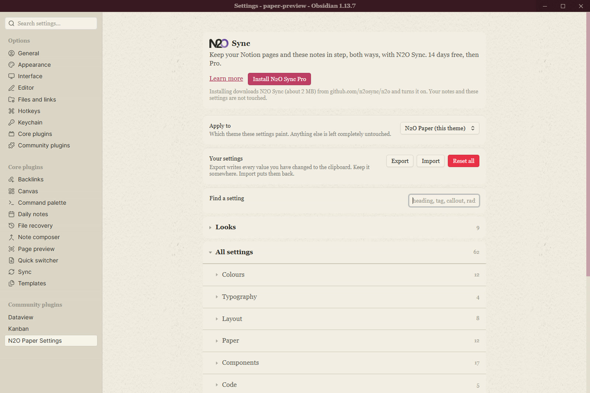
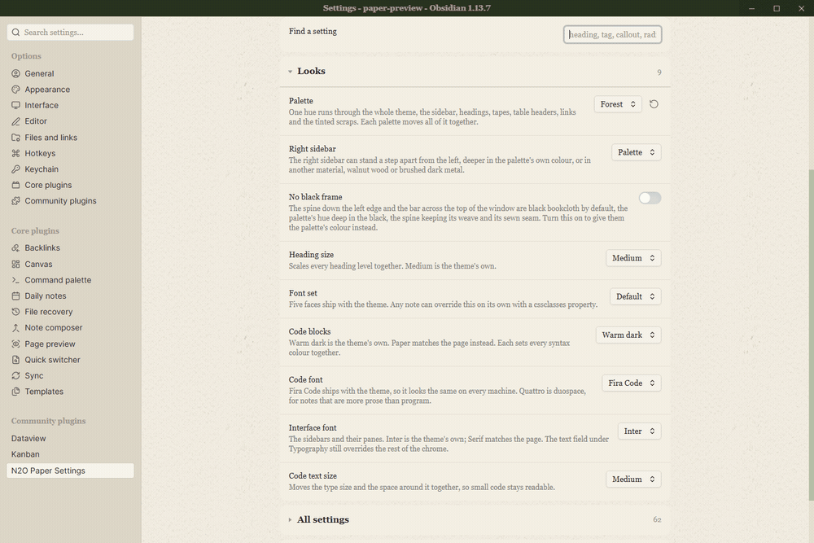
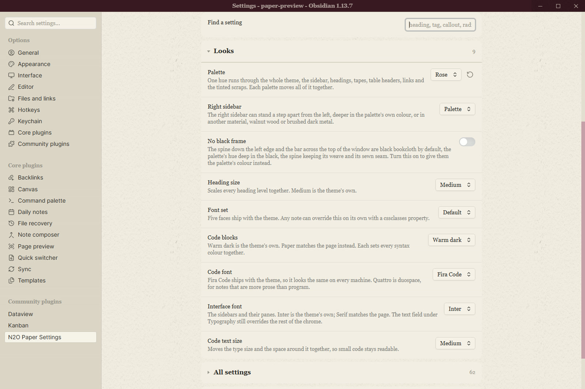
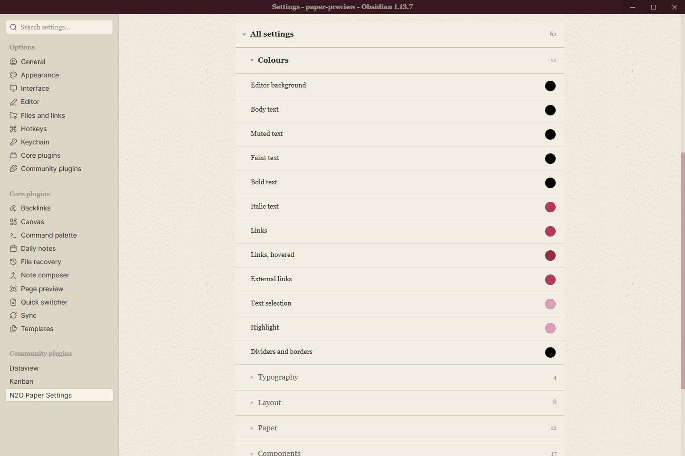
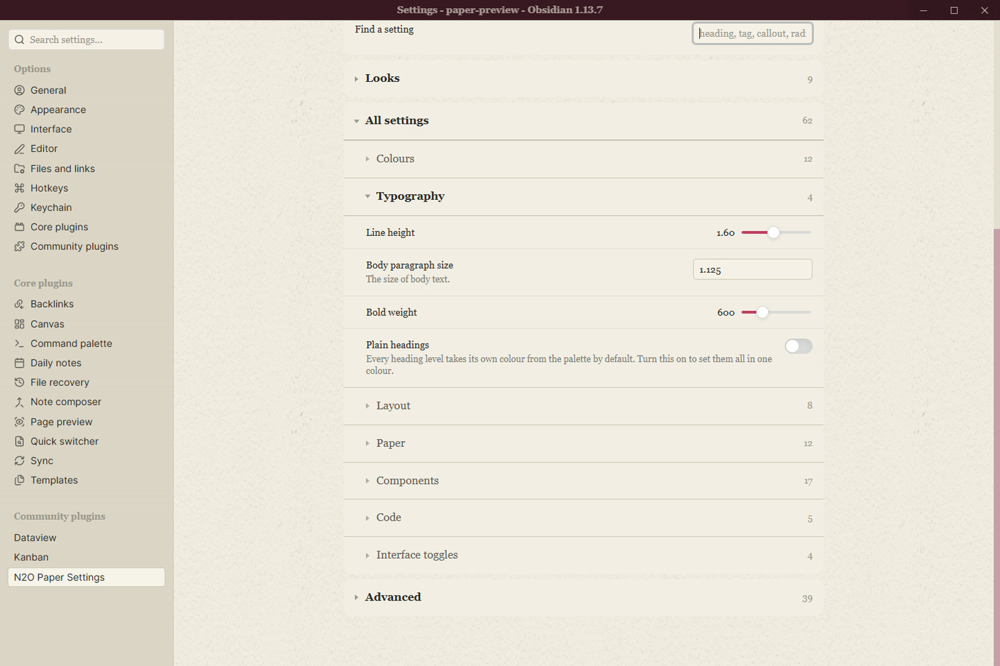
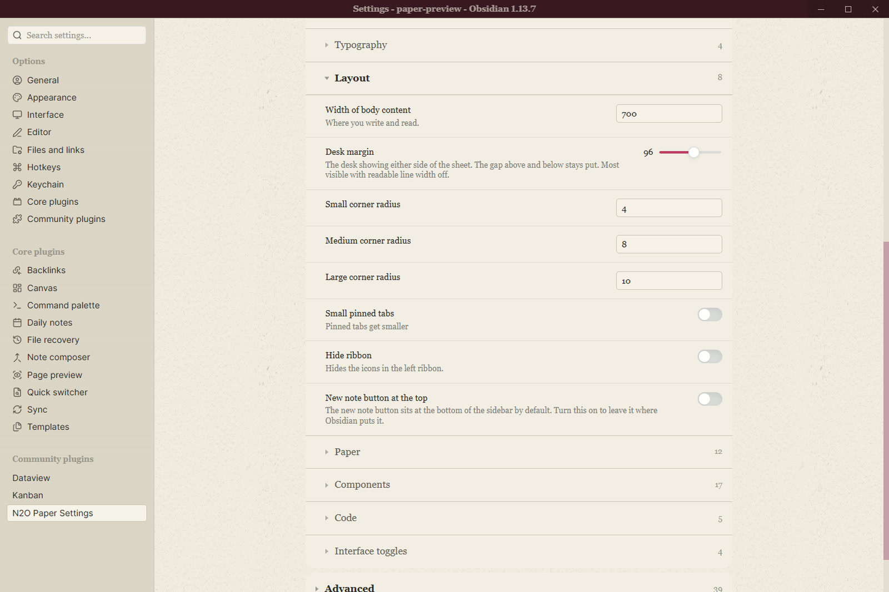
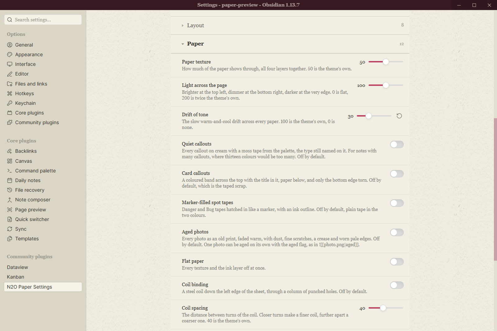
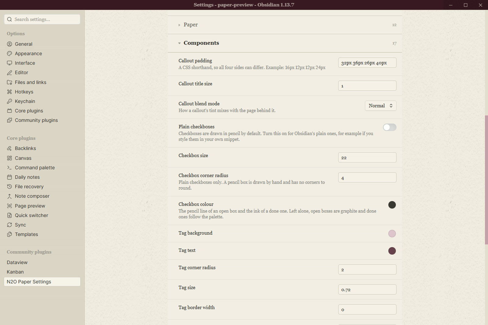
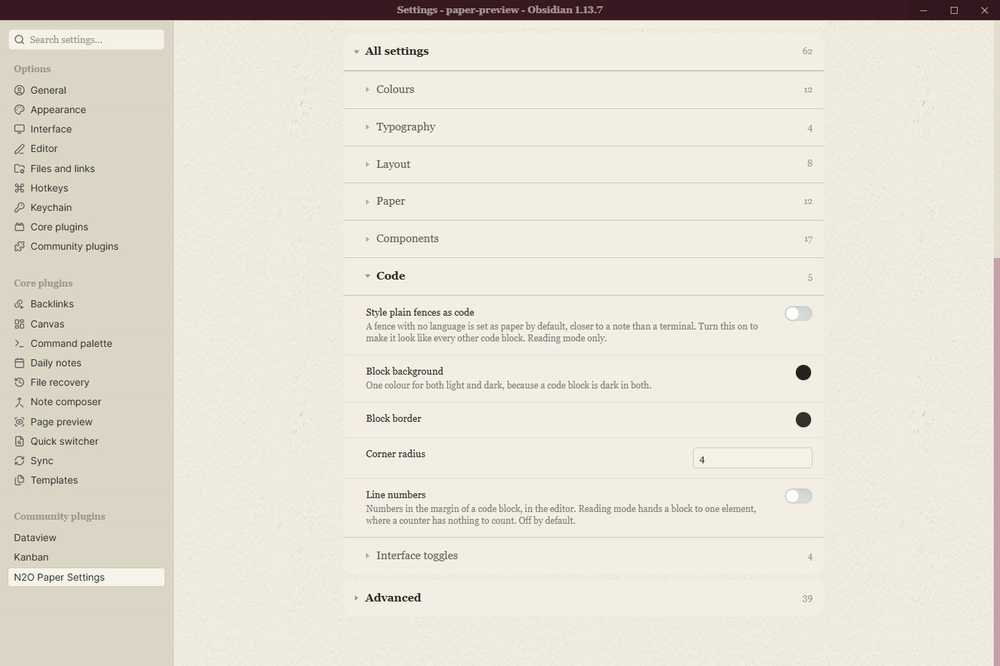
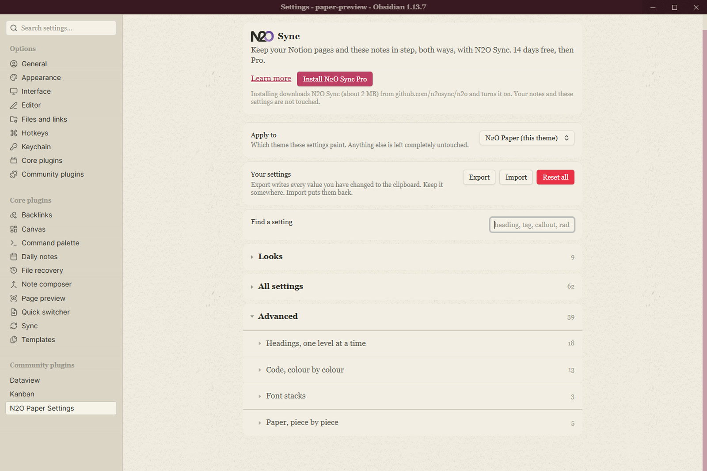

<picture>
  <source media="(prefers-color-scheme: dark)" srcset="images/n2o-wordmark-dark.svg">
  
</picture>

# N2O Paper Settings

Colour, typography, layout and component controls for the
[N2O Paper](https://github.com/n2osync/n2o-paper) theme, as a settings tab.

Part of **N2O**, with [N2O Paper](https://github.com/n2osync/n2o-paper) for the
look and [N2O Sync](https://n2osync.com) for Notion.

## What it does

A theme is CSS and cannot draw a settings tab, so this plugin reads the controls
N2O Paper declares and renders them: 110 of them, grouped the way the theme
groups them, with a search box, live colour swatches, and export and import.

**Looks** holds the palette, the heading colours and the paper feel.

**Colours** covers every ink on the page, each with a swatch you can see change.

**Typography** sets the page serif, the interface sans, the mono for code, and
the sizes.

**Layout** is the measure, the margins and the spacing.

**Paper** is the grain, the light, the drift and the softbox over the desk.

**Components** covers callouts, tables, tasks, tags, embeds and the rest.

**Code** colours the syntax, one token at a time.

**Advanced** holds the twin controls, the fine numbers behind the presets.

## Apply to

By default the plugin paints only while N2O Paper is the selected theme. Switch
to another theme and it applies nothing, and your values are kept for the switch
back. You can point it at a different installed theme, or at every theme.

## Export and import

Export writes every value you have changed to the clipboard. Import puts them
back. Reset asks first.

## Install

Settings > Community plugins > Browse, then search for N2O Paper Settings.

To install it by hand, download `main.js`, `manifest.json` and `styles.css` from
the latest release into `<vault>/.obsidian/plugins/n2o-paper-settings/`, then
turn it on in Community plugins.

## Licence

MIT. See LICENSE.md.
